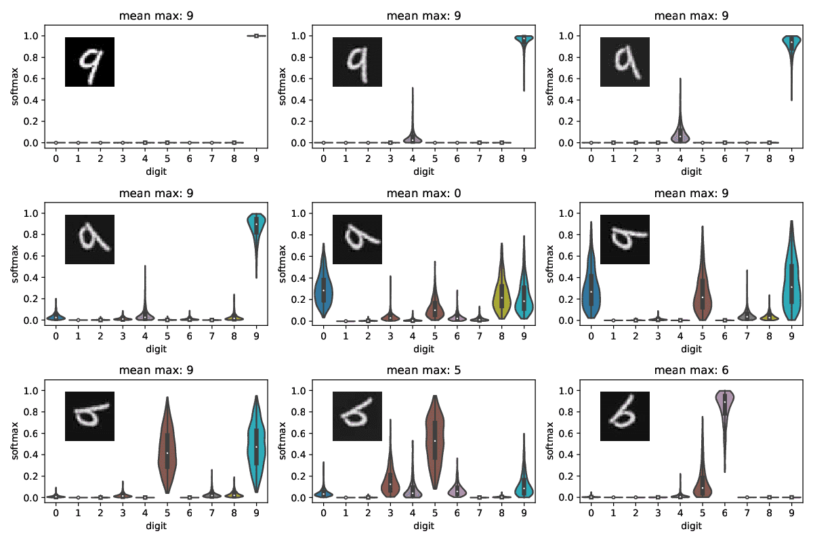
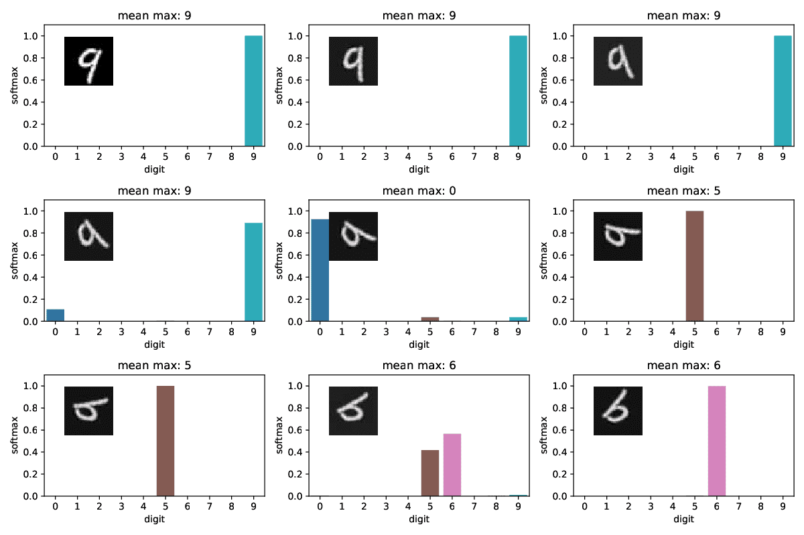
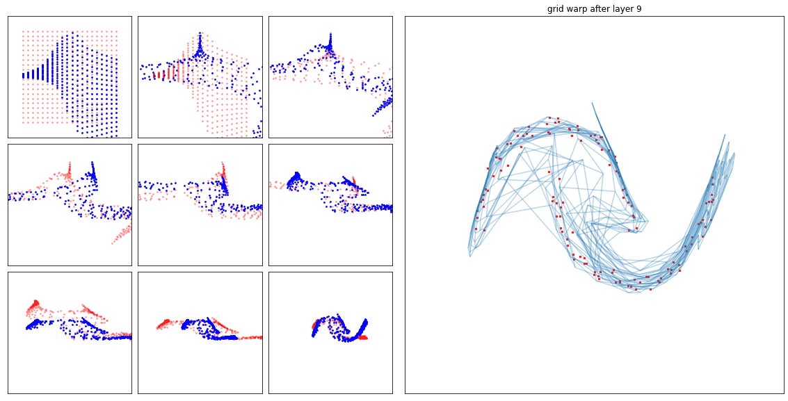
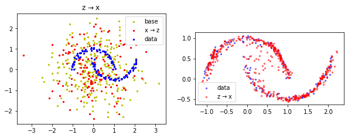
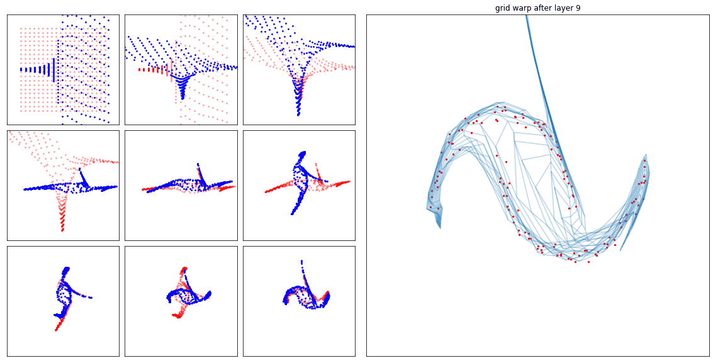
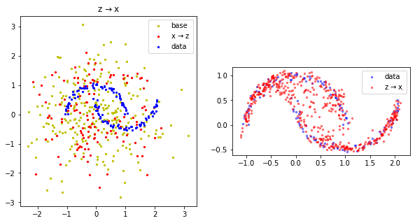
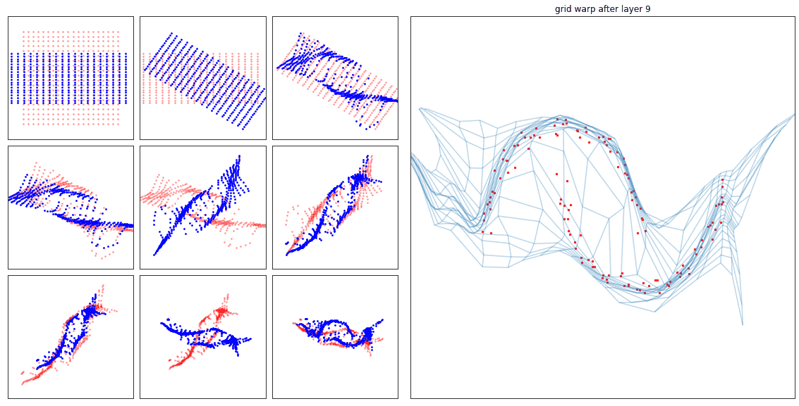
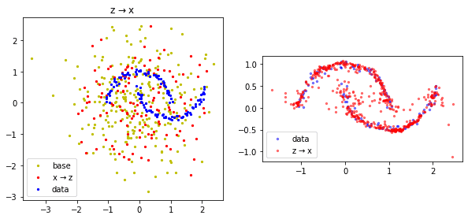
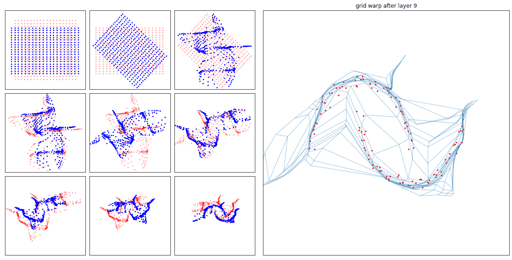
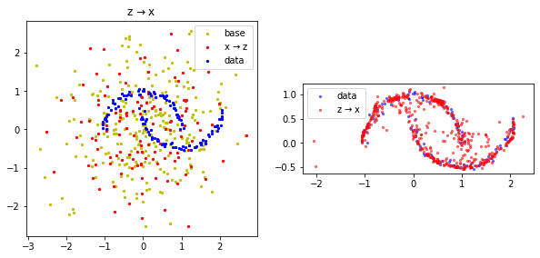

# Torch MNF

[](https://github.com/janosh/torch-mnf/actions)
[](https://results.pre-commit.ci/latest/github/janosh/torch-mnf/master)
[](/license)


PyTorch implementation of Multiplicative Normalizing Flows [[1]](#mnf-bnn).

With flow implementations courtesy of [Andrej Karpathy](https://github.com/karpathy/pytorch-normalizing-flows).

## Files of Interest

- [`notebooks/mnf_mnist.py`](torch_mnf/notebooks/mnf_mnist.py)
- [`models/mnf_lenet.py`](torch_mnf/models/mnf_lenet.py)
- [`flows/*.py`](torch_mnf/flows)
- [`layers/*.py`](torch_mnf/layers)

## MNF Results

### MNIST

Rotating an MNIST 9 by 180° in steps of 20°, the MNF LeNet (left) does not produce overconfident predictions on out-of-sample data unlike the regular LeNet (right), indicating it captures its own uncertainty well. The violin distributions in the top plot were generated by the MNF LeNet predicting each image 500 times. The predictions run in parallel so this is fast. Both models trained for 3 epochs on MNIST with Adam. The MNF model has 696,950 trainable parameters, the regular LeNet 258,582.

| MNF Lenet                                                   | Regular LeNet                                                  |
| ----------------------------------------------------------- | -------------------------------------------------------------- |
|  |  |

## Flow Results

### Real Non-Volume Preserving Flows

Flow: `[RNVP, RNVP, RNVP, RNVP, RNVP, RNVP, RNVP, RNVP, RNVP]`

Final loss: 0.47

| Trained for 1400 steps with Adam (`lr=1e-4, wd=1e-5`) | Parameters: 22,914                                        |
| ----------------------------------------------------- | --------------------------------------------------------- |
|  |  |

### Masked Autoregressive Flow

Flow: `[MAF, MAF, MAF, MAF, MAF, MAF, MAF, MAF, MAF]`

Final loss: 36.21

| Trained for 1400 steps with Adam (`lr=1e-4, wd=1e-5`) | Parameters: 12,348                                      |
| ----------------------------------------------------- | ------------------------------------------------------- |
|    |  |

### Neural Spline Flow Autoregressive Layer

Flow: `[ActNormFlow, Glow, NSF_AR, ActNormFlow, Glow, NSF_AR, ActNormFlow, Glow, NSF_AR]`

Final loss: 19.13

| Trained for 1400 steps with Adam (`lr=1e-4, wd=1e-5`)     | Parameters: 3,012                                             |
| --------------------------------------------------------- | ------------------------------------------------------------- |
|  |  |

### Neural Spline Flow Coupling Layer

Flow: `[ActNormFlow, Glow, NSF_CL, ActNormFlow, Glow, NSF_CL, ActNormFlow, Glow, NSF_CL]`

Final loss: 6.06

| Trained for 1400 steps with Adam (`lr=1e-4, wd=1e-5`)     | Parameters: 5,844                                             |
| --------------------------------------------------------- | ------------------------------------------------------------- |
|  |  |

## References

1. <a id="mnf-bnn"></a> **MNF**: _Multiplicative Normalizing Flows for Variational Bayesian Neural Networks_ | Christos Louizos, Max Welling (Mar 2017) | [1703.01961](https://arxiv.org/abs/1703.01961)

2. <a id="vi-nf"></a> **VI-NF**: _Variational Inference with Normalizing Flows_ | Danilo Rezende, Shakir Mohamed (May 2015) | [1505.05770](https://arxiv.org/abs/1505.05770)

3. <a id="made"></a> **MADE**: _Masked Autoencoder for Distribution Estimation_ | Mathieu Germain, Karol Gregor, Iain Murray, Hugo Larochelle (Jun 2015) | [1502.03509](https://arxiv.org/abs/1502.03509)

4. <a id="nice"></a> **NICE**: _Non-linear Independent Components Estimation_ | Laurent Dinh, David Krueger, Yoshua Bengio (Oct 2014) | [1410.8516](https://arxiv.org/abs/1410.8516)

5. <a id="rnvp"></a> **RNVP**: _Density estimation using Real NVP_ | Laurent Dinh, Jascha Sohl-Dickstein, Samy Bengio (May 2016) | [1605.08803](https://arxiv.org/abs/1605.08803)

6. <a id="maf"></a> **MAF**: _Masked Autoregressive Flow for Density Estimation_ | George Papamakarios, Theo Pavlakou, Iain Murray (Jun 2018) | [1705.07057](https://arxiv.org/abs/1705.07057)

7. <a id="iaf"></a> **IAF**: _Improving Variational Inference with Inverse Autoregressive Flow_ | Diederik Kingma et al. (Jun 2016) | [1606.04934](https://arxiv.org/abs/1606.04934)

8. <a id="nsf"></a> **NSF**: _Neural Spline Flows_ | Conor Durkan, Artur Bekasov, Iain Murray, George Papamakarios (Jun 2019) | [1906.04032](https://arxiv.org/abs/1906.04032)

## Debugging Tips

A great method of checking for infinite or `NaN` gradients is

```py
for name, param in model.named_parameters():
    print(name, torch.isfinite(param.grad).all())
    print(name, torch.isnan(param.grad).any())
```

There's also [`torch.autograd.detect_anomaly()`](https://pytorch.org/docs/stable/autograd.html#torch.autograd.detect_anomaly) used as context manager:

```py
with torch.autograd.detect_anomaly():
    x = torch.rand(10, 10, requires_grad=True)
    out = model(x)
    out.backward()
```

and [`torch.autograd.set_detect_anomaly(True)`](https://pytorch.org/docs/stable/autograd.html#torch.autograd.set_detect_anomaly). See [here](https://discuss.pytorch.org/t/87594) for an issue that used these tools.

## Requirements

[`requirements.txt`](requirements.txt) created with [`pipreqs .`](https://github.com/bndr/pipreqs). Find new dependencies manually with `pipreqs --diff requirements.txt`.
